# Screenshot of a Highlighted Conversation per Part
For those who want context about this series as it was unfolding, I highlighted a few comments I recieved for each part. Alternatively, take a look at `TextConversations` to read `.txt` versions of these conversations.
<!--ts-->
* [Screenshot of a Highlighted Conversation per Part](#screenshot-of-a-highlighted-conversation-per-part)
   * [Part 1 Secrecy](#part-1-secrecy)
   * [Part 2 Punching my mom](#part-2-punching-my-mom)
   * [Part 3 Matriarchy &amp; Estrangment](#part-3-matriarchy--estrangment)
   * [Part 4 Happy Moments &amp; Praise for Reviewers](#part-4-happy-moments--praise-for-reviewers)
   * [Part 5 Entitlement](#part-5-entitlement)
   * [Part 6 Judgement](#part-6-judgement)
   * [Part 7 Freedom](#part-7-freedom)
   * [Part 8 The boy that lived](#part-8-the-boy-that-lived)

<!-- Created by https://github.com/ekalinin/github-markdown-toc -->
<!-- Added by: shohid, at: Mon Oct 24 12:28:53 PM EDT 2022 -->

<!--te-->
## Part 1 Secrecy
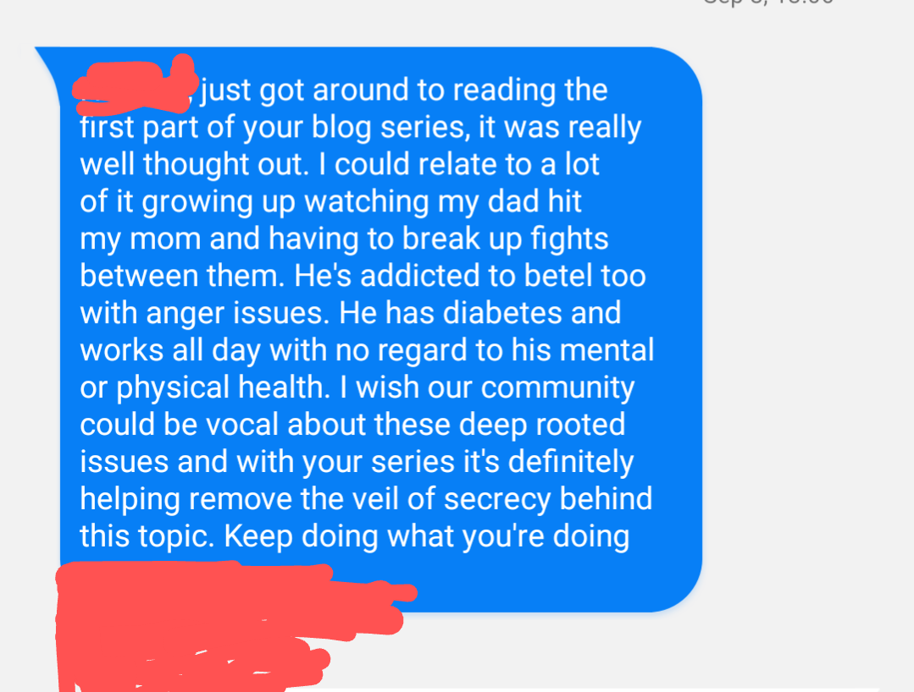
---
## Part 2 Punching my mom

---
## Part 3 Matriarchy & Estrangment
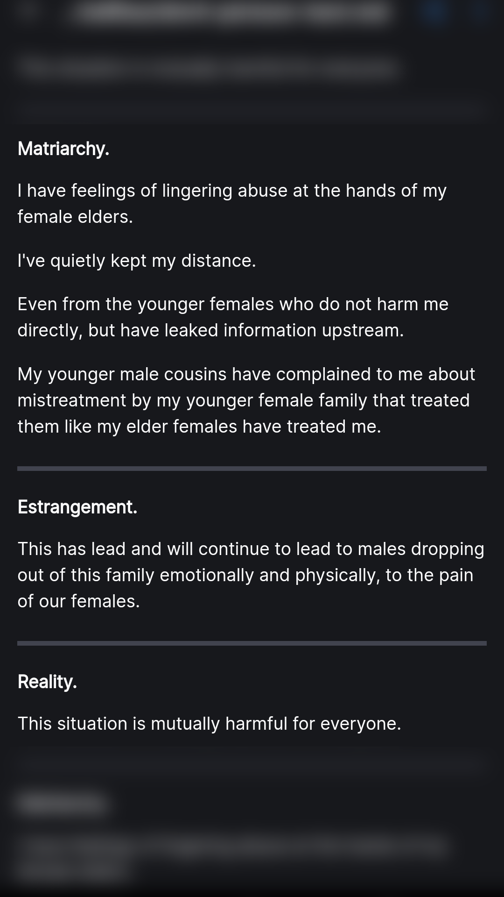
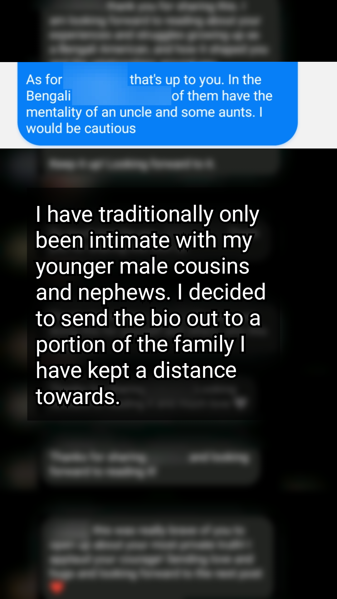
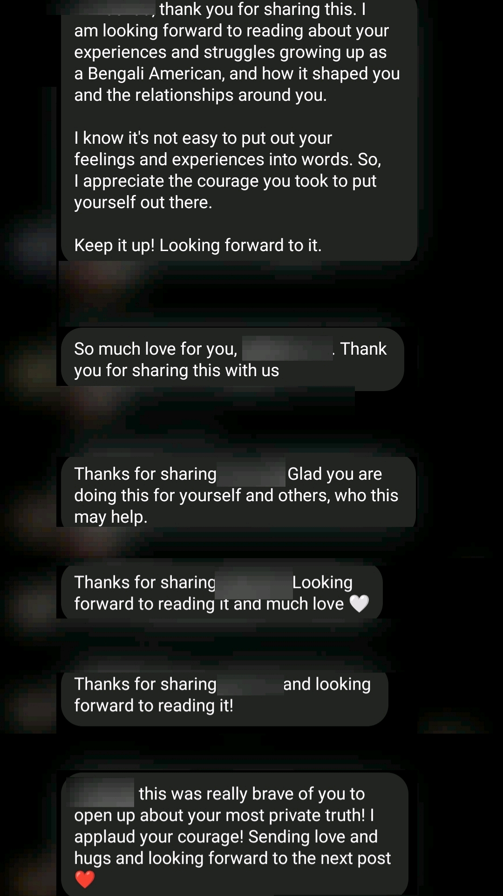
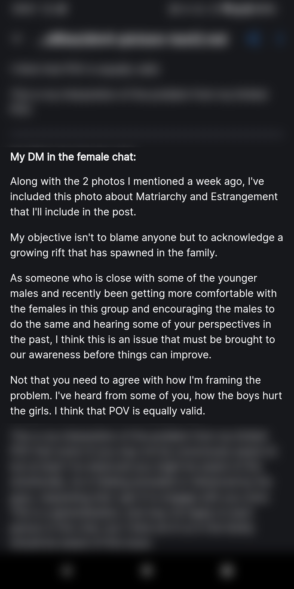
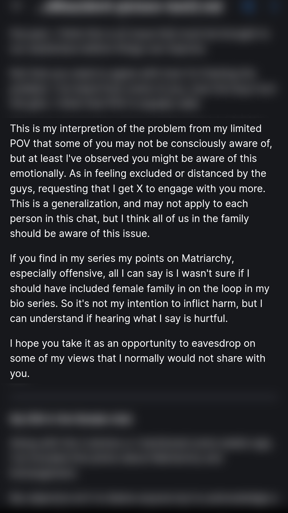
---
## Part 4 Happy Moments & Praise for Reviewers
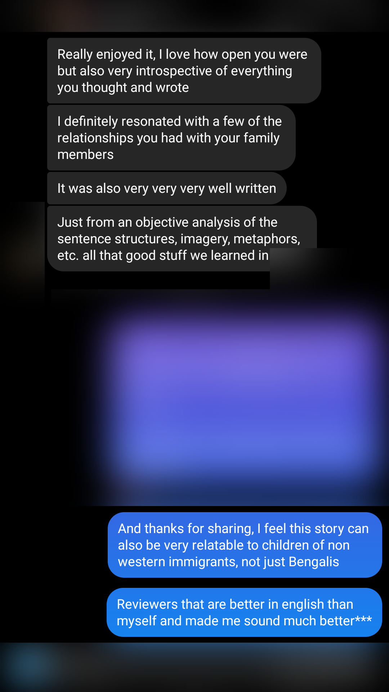
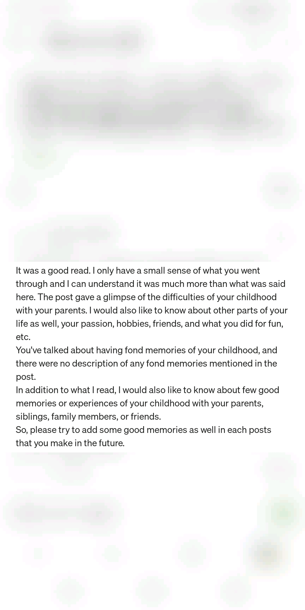
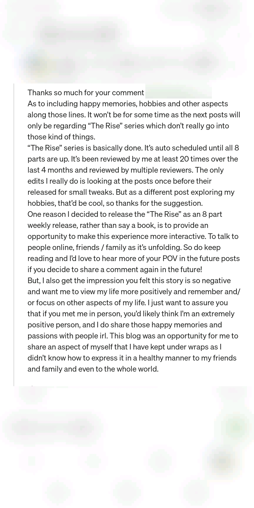
---
## Part 5 Entitlement
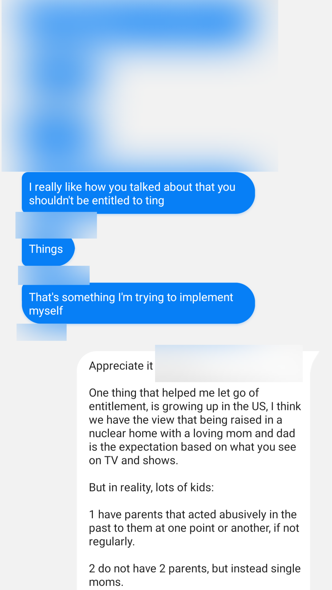
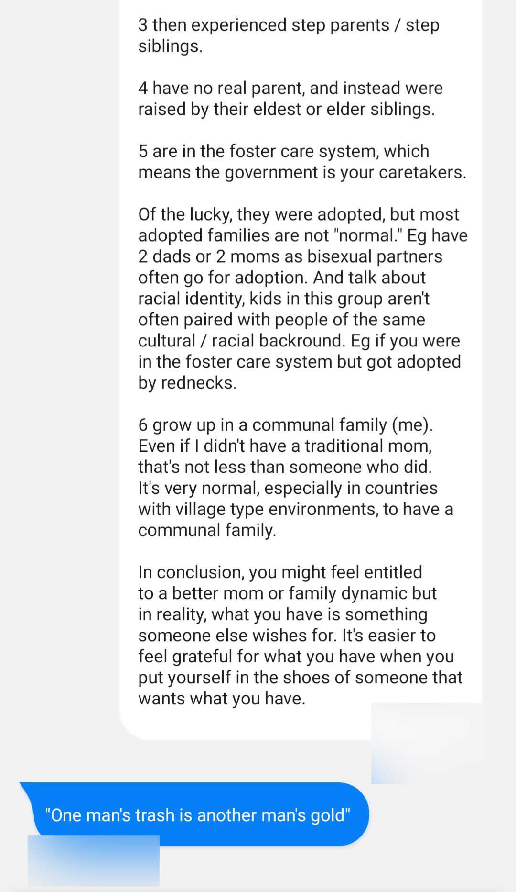
---
## Part 6 Judgement
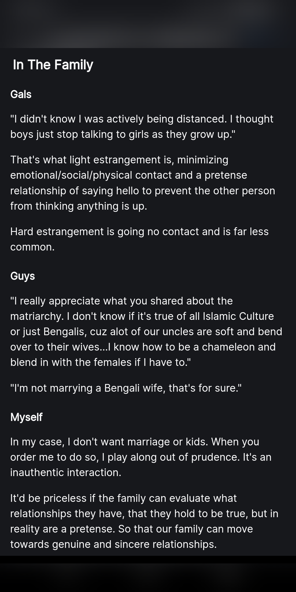
---
## Part 7 Freedom
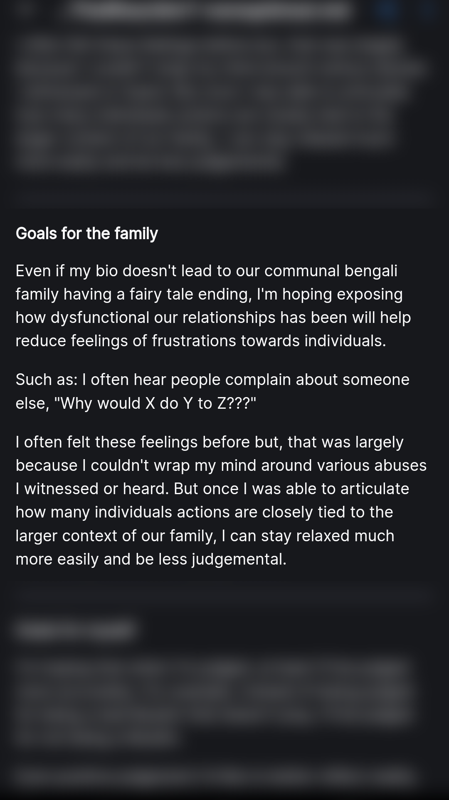

---
## Part 8 The boy that lived
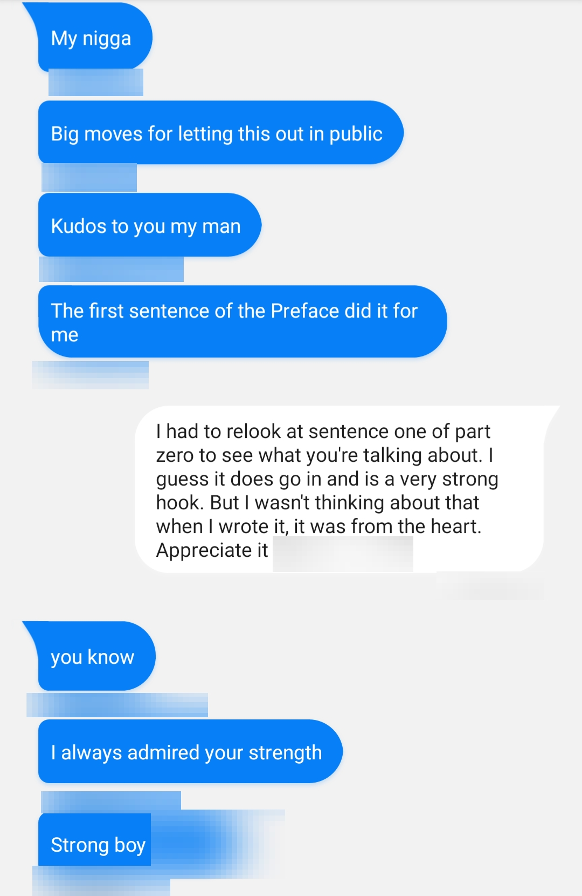
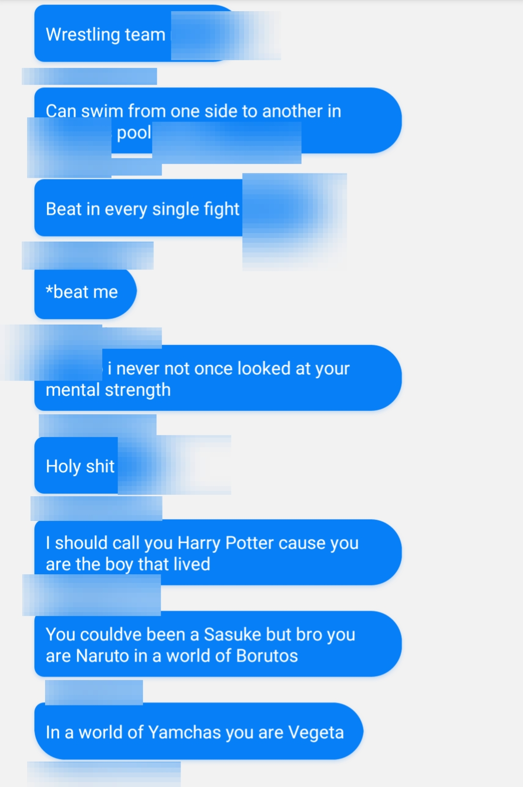
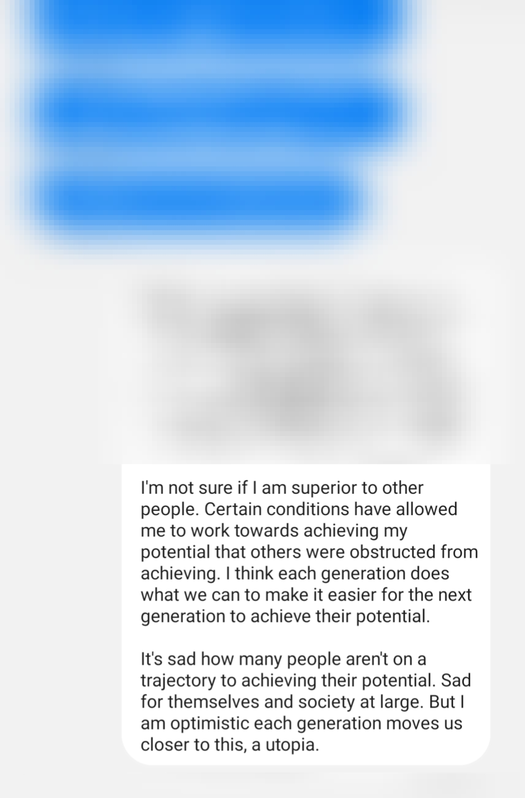
